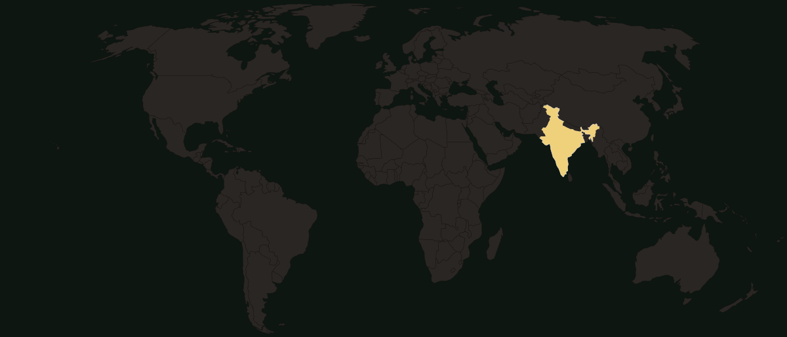

# World Map SVG with India's Complete Borders

A free, lightweight **world map SVG** in which **India is drawn with its full official
borders** — including **Jammu & Kashmir, Aksai Chin, Pakistan-occupied Kashmir (PoK) and
Arunachal Pradesh**. No labels, no text, no dependencies. Every country is a single `<path>`
tagged with its ISO code, so it drops straight into a web page and each country is
individually styleable and clickable.

If you have ever pulled a world map off the shelf and found **India shown on the UN / "de
facto" line** — with the north of Kashmir and Arunachal Pradesh cut away — this is the fix.
Almost every ready-made world map SVG has that problem. This one does not.



## Why this exists

Most world-map SVGs and map libraries render India on the disputed **Line of Control**, so
India appears missing large areas it officially claims. Indian government guidelines require
those areas to be shown as part of India. Correcting a generic map by hand is error-prone;
this map instead starts from geometry that already has India completed and simply cleans and
projects it.

## What's in the box

| File | What it is |
| --- | --- |
| `world-map.svg` | The map. Robinson projection, ~140&nbsp;KB, one `<path>` per country. |
| `world-india-complete.geo.json` | Source geometry (Natural Earth + India completed). |
| `build-world-map.js` | Node script that regenerates `world-map.svg` from the GeoJSON. |
| `index.html` | A tiny demo page that renders the map. |

### Each country path carries

```html
<path data-iso="in" data-name="India" data-continent="Asia" d="…"/>
```

- `data-iso` — lowercase **ISO 3166-1 alpha-2** (e.g. `in`, `us`, `gb`). Use it to join your
  own data to the map.
- `data-name` — plain English country name.
- `data-continent` — `Africa` · `Americas` · `Asia` · `Europe` · `Oceania`.

The root `<svg>` also carries a `data-regions` attribute — a JSON object of ready-made
`viewBox` values for a **World / continent zoom** control:

```js
const regions = JSON.parse(document.querySelector('svg').dataset.regions);
svg.setAttribute('viewBox', regions.Asia); // zoom to Asia
```

## Use it

Drop the SVG inline (so you can style paths with CSS) and colour countries however you like:

```html
<style>
  .world-map path { fill: #2a2624; stroke: #14100d; stroke-width: .5; }
  .world-map path[data-iso="in"] { fill: #efd07b; }   /* highlight India */
  .world-map path:hover { fill: #c69a49; cursor: pointer; }
</style>
<!-- paste the contents of world-map.svg here, or fetch() and inject it -->
```

Or fetch and inject it at runtime:

```js
fetch('world-map.svg').then(r => r.text()).then(svg => {
  document.getElementById('map').innerHTML = svg;
});
```

## Rebuild it

Any Node 18+ (no npm install needed — zero dependencies):

```bash
node build-world-map.js
```

If you regenerate or edit the SVG, **keep the `data-iso` attributes** — they are how the map
is keyed to data.

## Credits & licence

- **Base geometry:** [Natural Earth](https://www.naturalearthdata.com) — **public domain**.
- **India-complete borders:** built on the community *World-Map-India-Complete* dataset, which
  corrects India on top of that same public-domain data. Borders are geographic facts and are
  not themselves copyrightable.
- **This packaging, the Robinson converter and the generated SVG:** by **Sameer Shreenivas
  Mittimani** (GitHub: [cercit](https://github.com/cercit)).

The map data (`world-map.svg`, `world-india-complete.geo.json`) is released to the **public
domain** — use it anywhere, no attribution required (a link back is appreciated). The build
script is **MIT**-licensed; see [`LICENSE`](LICENSE).

> Borders on this map reflect India's official position. It is provided for general and
> illustrative use.

---

**Keywords:** world map svg, india map correct borders, india complete map, official india
borders, aksai chin, pakistan occupied kashmir, arunachal pradesh, jammu kashmir, natural
earth, robinson projection, iso 3166 country codes, choropleth base map, blank world map,
free svg map.
